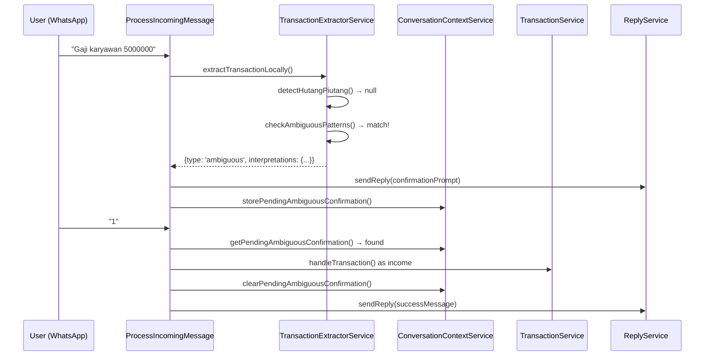

# Design Document: Ambiguous Transaction Confirmation

## Overview

Fitur ini menambahkan kemampuan sistem untuk mendeteksi pesan transaksi yang ambigu — di mana teks secara bersamaan cocok dengan pola pemasukan DAN pengeluaran — dan meminta klarifikasi dari user sebelum mencatat transaksi.

Contoh kasus: "Gaji karyawan 5000000" bisa berarti:
- **Pemasukan**: Menerima gaji (pendapatan_gaji)
- **Pengeluaran**: Membayar gaji karyawan (pengeluaran_gaji_karyawan)

Pendekatan: Sistem mendeteksi pola ambigu dari config, mengirim prompt ke user via WhatsApp dengan 2 opsi, menyimpan state di ConversationContext, dan memproses jawaban user.

## Architecture



### Insertion Points

Perubahan disisipkan ke flow yang sudah ada:

1. **TransactionExtractorService::extractTransactionLocally()** — Tambah deteksi ambigu SETELAH hutang/piutang early return, SEBELUM position-based income check.
2. **ProcessIncomingMessage::processTextMessage()** — Tambah handling untuk:
   - Respons ambiguous dari extractor (kirim prompt, simpan pending)
   - Reply "1"/"2" dari user (SEBELUM existing "ya/iya/ok" confirmation check)
3. **ConversationContextService** — Gunakan existing `storePendingConfirmation` / `getPendingConfirmation` / `clearPendingConfirmation` dengan data schema yang diperluas untuk ambiguous.
4. **config/finwa_category_rules.php** — Tambah key `ambiguous_transaction_patterns`.

## Components and Interfaces

### 1. Config: `ambiguous_transaction_patterns`

```php
// config/finwa_category_rules.php
'ambiguous_transaction_patterns' => [
    [
        'pattern' => 'gaji karyawan',
        'income_category_type' => 'pendapatan_gaji',
        'expense_category_type' => 'pengeluaran_gaji_karyawan',
    ],
    // Entri tambahan bisa ditambahkan tanpa perubahan kode
],
```

### 2. TransactionExtractorService — Ambiguous Detection

Metode baru `detectAmbiguousPattern(string $textLower): ?array`

```php
/**
 * Detect if message matches an ambiguous pattern from config.
 * 
 * @param string $textLower Lowercase message text
 * @return array|null null if no match, otherwise:
 *   [
 *     'pattern' => string,           // matched pattern
 *     'income_category_type' => string,
 *     'expense_category_type' => string,
 *   ]
 */
protected function detectAmbiguousPattern(string $textLower): ?array
```

Insertion di `extractTransactionLocally()`:

```php
// AFTER hutang/piutang early return
// BEFORE position-based income check

$ambiguousMatch = $this->detectAmbiguousPattern($textLower);
if ($ambiguousMatch !== null) {
    $transactionDate = $this->extractDateFromText($messageText) ?? now()->toDateString();
    return [
        'type' => 'ambiguous',
        'amount' => $amount,
        'description' => $messageText,
        'transaction_date' => $transactionDate,
        'pattern' => $ambiguousMatch['pattern'],
        'income_category_type' => $ambiguousMatch['income_category_type'],
        'expense_category_type' => $ambiguousMatch['expense_category_type'],
        'confidence_score' => 0.50,
        'source' => 'local_extraction',
    ];
}
```

### 3. ProcessIncomingMessage — Ambiguous Result Handling

Pada saat `transactionService->handleTransaction()` atau `extractTransactionLocally()` mengembalikan type `ambiguous`, job mengirim prompt dan menyimpan pending.

Metode baru: `handleAmbiguousTransaction(array $ambiguousResult, ConversationContextService $contextService): void`

```php
protected function handleAmbiguousTransaction(array $ambiguousResult, ConversationContextService $contextService): void
{
    $amount = $ambiguousResult['amount'];
    $formattedAmount = 'Rp ' . number_format($amount, 0, ',', '.');
    $description = $ambiguousResult['description'];
    
    // Build human-readable category names
    $incomeCategoryName = $this->getCategoryDisplayName($ambiguousResult['income_category_type']);
    $expenseCategoryName = $this->getCategoryDisplayName($ambiguousResult['expense_category_type']);
    
    $prompt = "🤔 *Konfirmasi Tipe Transaksi*\n\n" .
        "Pesan: _{$description}_\n" .
        "Jumlah: *{$formattedAmount}*\n\n" .
        "Ketik 1 untuk Pemasukan ({$incomeCategoryName})\n" .
        "Ketik 2 untuk Pengeluaran ({$expenseCategoryName})";
    
    try {
        $this->replyService->sendReply($prompt);
    } catch (\Exception $e) {
        Log::error('Failed to send ambiguous confirmation prompt', [...]);
        return; // Do NOT store pending if send fails
    }
    
    $contextService->storePendingConfirmation([
        'original_message' => $description,
        'description' => $description,
        'amount' => $amount,
        'type' => 'ambiguous',
        'income_category_type' => $ambiguousResult['income_category_type'],
        'expense_category_type' => $ambiguousResult['expense_category_type'],
        'transaction_date' => $ambiguousResult['transaction_date'],
        'retry_count' => 0,
    ]);
}
```

### 4. ProcessIncomingMessage — Reply Handling

Tambahkan di `processTextMessage()` SEBELUM existing "ya/iya/ok" confirmation check:

```php
// PRIORITY CHECK: Pending ambiguous confirmation ("1", "2", "pemasukan", etc.)
$pendingAmbiguous = $contextService->getPendingConfirmation();
if ($pendingAmbiguous && ($pendingAmbiguous['type'] ?? null) === 'ambiguous') {
    $this->handleAmbiguousReply($msgTrimmed, $pendingAmbiguous, $contextService);
    return;
}
```

Metode baru: `handleAmbiguousReply(string $reply, array $pending, ConversationContextService $contextService): void`

```php
protected function handleAmbiguousReply(
    string $reply,
    array $pending,
    ConversationContextService $contextService
): void {
    $normalized = strtolower(trim($reply));
    
    // Check if this is a NEW transaction (has amount > 2 and not just a keyword)
    if ($this->isNewTransactionMessage($normalized, $reply)) {
        $contextService->clearPendingConfirmation();
        $this->processTextMessage($reply); // Re-route as new message
        return;
    }
    
    // Check for valid income responses
    if ($normalized === '1' || str_contains($normalized, 'pemasukan') || str_contains($normalized, 'masuk')) {
        $this->processAmbiguousAsType($pending, 'income', $contextService);
        return;
    }
    
    // Check for valid expense responses
    if ($normalized === '2' || str_contains($normalized, 'pengeluaran') || str_contains($normalized, 'keluar')) {
        $this->processAmbiguousAsType($pending, 'expense', $contextService);
        return;
    }
    
    // Invalid reply
    $retryCount = $pending['retry_count'] ?? 0;
    if ($retryCount >= 1) {
        // Max retries reached — cancel
        $contextService->clearPendingConfirmation();
        $this->replyService->sendReply("❌ Konfirmasi dibatalkan. Silakan kirim ulang transaksi Anda.");
        return;
    }
    
    // Resend prompt with hint
    $pending['retry_count'] = $retryCount + 1;
    $contextService->storePendingConfirmation($pending);
    
    $this->replyService->sendReply(
        "⚠️ Jawaban tidak dikenali.\n\n" .
        "Balas dengan:\n" .
        "• *1* atau *pemasukan* atau *masuk* untuk Pemasukan\n" .
        "• *2* atau *pengeluaran* atau *keluar* untuk Pengeluaran"
    );
}
```

### 5. Process Confirmed Transaction

```php
protected function processAmbiguousAsType(
    array $pending,
    string $type,
    ConversationContextService $contextService
): void {
    $categoryType = $type === 'income'
        ? $pending['income_category_type']
        : $pending['expense_category_type'];
    
    $contextService->clearPendingConfirmation();
    
    // Create transaction directly
    $this->transactionService->handleTransaction(
        $pending['original_message'],
        null,
        [
            'force_type' => $type,
            'force_category_type' => $categoryType,
            'transaction_date' => $pending['transaction_date'] ?? now()->toDateString(),
        ]
    );
    
    $typeName = $type === 'income' ? 'Pemasukan' : 'Pengeluaran';
    $formattedAmount = 'Rp ' . number_format($pending['amount'], 0, ',', '.');
    $categoryName = $this->getCategoryDisplayName($categoryType);
    
    $this->replyService->sendReply(
        "✅ Transaksi dicatat!\n\n" .
        "📝 *{$typeName}* {$formattedAmount}\n" .
        "📂 Kategori: {$categoryName}"
    );
}
```

## Data Models

### Pending Ambiguous Confirmation (stored in ConversationContext entities)

```php
// entities['pending_confirmation'] schema for ambiguous:
[
    'original_message' => string,     // Pesan asli user
    'description' => string,          // Deskripsi transaksi
    'amount' => int|float,            // Jumlah yang terdeteksi
    'type' => 'ambiguous',            // Marker untuk membedakan dari pending biasa
    'income_category_type' => string, // e.g. 'pendapatan_gaji'
    'expense_category_type' => string,// e.g. 'pengeluaran_gaji_karyawan'
    'transaction_date' => string,     // Y-m-d format
    'retry_count' => int,             // 0 or 1 (max 1 retry)
    'created_at' => string,           // ISO 8601 timestamp
]
```

### Ambiguous Extractor Result

```php
// Return value dari extractTransactionLocally() ketika ambiguous:
[
    'type' => 'ambiguous',
    'amount' => int|float,
    'description' => string,
    'transaction_date' => string,
    'pattern' => string,                // matched config pattern
    'income_category_type' => string,
    'expense_category_type' => string,
    'confidence_score' => 0.50,
    'source' => 'local_extraction',
]
```

### Config Entry Schema

```php
// Each entry in config('finwa_category_rules.ambiguous_transaction_patterns')
[
    'pattern' => string,               // 2-100 chars, lowercase, substring match
    'income_category_type' => string,  // valid category_type
    'expense_category_type' => string, // valid category_type
]
```

## Correctness Properties

*A property is a characteristic or behavior that should hold true across all valid executions of a system — essentially, a formal statement about what the system should do. Properties serve as the bridge between human-readable specifications and machine-verifiable correctness guarantees.*

### Property 1: Ambiguous Detection Correctness

*For any* message string that contains a valid ambiguous pattern (from config, case-insensitive substring match) AND a valid extractable amount > 0, calling `detectAmbiguousPattern()` SHALL return a non-null array with the matched pattern, income_category_type, and expense_category_type matching the config entry. Conversely, for any message that does NOT contain any configured ambiguous pattern, `detectAmbiguousPattern()` SHALL return null.

**Validates: Requirements 1.1, 1.2, 1.4**

### Property 2: Reply-to-Transaction-Type Mapping

*For any* normalized reply string, if it equals "1" OR contains "pemasukan" OR contains "masuk", the system SHALL map it to transaction type "income" with the stored income_category_type. If it equals "2" OR contains "pengeluaran" OR contains "keluar", the system SHALL map it to transaction type "expense" with the stored expense_category_type. The mapping is deterministic regardless of whitespace or casing variations in the original reply.

**Validates: Requirements 3.1, 3.2, 3.3**

### Property 3: Confirmation Prompt Contains Required Fields

*For any* ambiguous detection result with an amount and two interpretations, the generated confirmation prompt string SHALL contain: the original message text, the amount formatted as "Rp X.XXX", a "1" option referencing income category name, and a "2" option referencing expense category name.

**Validates: Requirements 2.2, 2.3**

### Property 4: Invalid Reply Detection

*For any* string that is NOT one of the valid confirmation keywords ("1", "2") AND does NOT contain "pemasukan", "pengeluaran", "masuk", or "keluar" as substrings AND is NOT a new transaction message (amount > 2), the system SHALL classify it as an invalid reply when a pending ambiguous confirmation exists.

**Validates: Requirements 4.1**

### Property 5: Config Entry Validation and Resilience

*For any* array of config entries, entries missing any of the three required keys ('pattern', 'income_category_type', 'expense_category_type') SHALL be skipped, while entries with all three valid keys SHALL be usable for pattern matching.

**Validates: Requirements 5.2, 5.5**

## Error Handling

| Scenario | Handling |
|----------|----------|
| WhatsApp send fails | Log error, do NOT store pending confirmation (Req 2.6) |
| Config entry missing keys | Skip entry, continue processing (Req 5.5) |
| Invalid user reply (1st time) | Resend prompt with hint, increment retry_count (Req 4.1) |
| Invalid user reply (2nd time) | Cancel confirmation, clear pending (Req 4.2) |
| Pending expired (>5 min) | Existing `getPendingConfirmation()` handles this via 5-min expiry check |
| New transaction while pending | Clear old pending, process new message normally (Req 4.4) |
| `handleTransaction` with force params fails | Log error, send failure message to user |

## Testing Strategy

### Unit Tests (Example-Based)

1. **Execution order**: Verify hutang/piutang messages bypass ambiguous detection
2. **Prompt sending + storage**: Integration test that ambiguous result triggers prompt AND stores pending
3. **Existing pending overwrite**: Verify new ambiguous replaces old pending
4. **Send failure handling**: Mock sendReply to throw, verify no pending stored
5. **Confirmation clears pending**: After "1" or "2", pending is removed
6. **Retry limit**: After 2 invalid replies, confirmation is cancelled
7. **Expiry**: Message older than 5 min is treated as new
8. **Config has "gaji karyawan" entry**: Smoke test for minimum config

### Property-Based Tests

Library: **Pest** with custom data providers generating randomized inputs (100+ iterations per property).

Each property test must:
- Run minimum 100 iterations
- Reference its design property in a comment tag
- Use random generators for message text, amounts, reply strings

Tag format: `Feature: ambiguous-transaction-confirmation, Property {N}: {title}`

| Property | Generator Strategy |
|----------|-------------------|
| P1: Detection | Random strings ± ambiguous patterns, random valid amounts |
| P2: Reply mapping | Random strings with/without valid keywords, whitespace/casing variations |
| P3: Prompt format | Random amounts (1–999999999), random descriptions, random category names |
| P4: Invalid reply | Random strings excluding valid keywords, verify classification |
| P5: Config validation | Random arrays with/without required keys |
