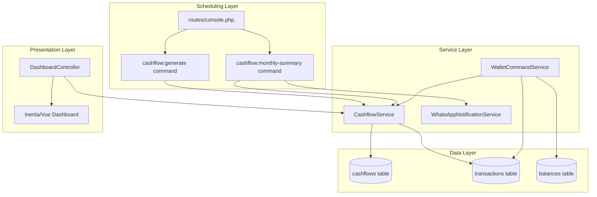

# Design Document: Cashflow & Linked Transfers

## Overview

This design covers two interconnected features:

1. **CashflowService** — A dedicated service layer that calculates, persists, and queries cashflow data, replacing the inline calculation currently in `DashboardController`. Supported by an artisan command (`cashflow:generate`) with scheduling, a monthly WhatsApp summary notification, and historical analytics.

2. **Linked Internal Transfers** — Adding a `linked_transaction_id` foreign key to the `transactions` table so that paired `debit_internal`/`kredit_internal` transactions reference each other directly. This enables atomic transfer creation, clean undo logic, and explicit report exclusion without relying solely on the `transfer_ref` metadata pattern.

### Design Decisions

| Decision | Rationale |
|----------|-----------|
| Extract CashflowService from DashboardController | Controller is 200+ lines of inline cashflow logic; service enables reuse from command, dashboard, and WhatsApp notification |
| Use `linked_transaction_id` self-referential FK | Simpler than a join table; matches the 1:1 paired nature of internal transfers |
| Keep `transfer_ref` metadata backward compatible | Legacy transfers already use this pattern; new linked_transaction_id is additive |
| Monthly WhatsApp via scheduled command | Consistent with existing patterns (SendMidMonthCashflow, SendWeeklyDigest) |
| Single CashflowService class (not split) | Feature scope is contained; avoids over-engineering for ~5 public methods |

## Architecture



### Component Interaction Flow

**Cashflow Calculation:**
1. `DashboardController::index()` calls `CashflowService::calculateForPeriod()`
2. `cashflow:generate` command iterates tenants, calls same method
3. `CashflowService` queries confirmed transactions, excludes internal types, persists to `cashflows`

**Internal Transfer (New Flow):**
1. User requests transfer via WhatsApp
2. `WalletCommandService::handleTransferBetweenWallets()` wraps in DB transaction
3. Creates debit transaction → creates credit transaction → links both via `linked_transaction_id`
4. Updates both wallet balances atomically

**Undo Transfer:**
1. User requests undo via WhatsApp
2. `WalletCommandService` loads transaction + linked counterpart
3. Reverses both balances, deletes both transactions in single DB transaction

## Components and Interfaces

### 1. CashflowService

**Location:** `app/Services/CashflowService.php`

```php
<?php

namespace App\Services;

use App\Models\Cashflow;
use Illuminate\Support\Collection;

class CashflowService
{
    /**
     * Calculate and persist cashflow for a tenant and period.
     * Excludes debit_internal/kredit_internal from income/expense totals.
     * Updates existing record if one exists for the same period.
     */
    public function calculateForPeriod(
        int $tenantId,
        string $periodType, // 'daily' | 'weekly' | 'monthly'
        ?\Carbon\Carbon $referenceDate = null
    ): Cashflow;

    /**
     * Get cashflow data formatted for the dashboard response.
     * Includes current period, previous period comparison, percentage changes, and health status.
     */
    public function getDashboardData(int $tenantId): array;

    /**
     * Get chart data (monthly income/expense/net) for the last N months.
     * Calculates on-demand if Cashflow records don't exist for historical periods.
     */
    public function getChartData(int $tenantId, int $months = 6): array;

    /**
     * Query cashflow records filtered by tenant, period type, and date range.
     */
    public function query(int $tenantId, ?string $periodType = null, ?\Carbon\Carbon $from = null, ?\Carbon\Carbon $to = null): Collection;

    /**
     * Format a monthly summary message for WhatsApp notification.
     */
    public function formatMonthlySummary(int $tenantId, \Carbon\Carbon $month): string;
}
```

### 2. Artisan Command: `cashflow:generate`

**Location:** `app/Console/Commands/GenerateCashflow.php`

```php
protected $signature = 'cashflow:generate
    {--period=monthly : Period type (daily, weekly, monthly)}
    {--tenant= : Specific tenant ID (optional, defaults to all active tenants)}';

protected $description = 'Generate cashflow reports for tenants';
```

**Behavior:**
- Without `--tenant`: iterates all active tenants
- With `--tenant=ID`: processes single tenant (exits with code 1 if not found)
- Calls `CashflowService::calculateForPeriod()` for each tenant

### 3. Artisan Command: `cashflow:monthly-summary`

**Location:** `app/Console/Commands/SendMonthlyCashflowSummary.php`

```php
protected $signature = 'cashflow:monthly-summary
    {--test : Test mode - only show messages without sending}
    {--limit=0 : Limit tenants (0 = all)}';

protected $description = 'Send monthly cashflow summary via WhatsApp';
```

**Behavior:**
- Scheduled to run on 1st of each month at 08:00
- Iterates active tenants with WhatsApp channels
- Uses `CashflowService::formatMonthlySummary()` for message content
- Retries up to 3 times with exponential backoff on failure
- Skips tenants without active WhatsApp channels silently

### 4. DashboardController Updates

**Changes to `app/Http/Controllers/DashboardController.php`:**
- Replace inline cashflow calculation (~lines 30-90) with `CashflowService::getDashboardData()`
- Replace inline `getChartData()` method with `CashflowService::getChartData()`
- Add `internal_transfer_volume` metric to the cashflow response payload

### 5. Transaction Model Updates

**Location:** `app/Models/Transaction.php`

```php
// New relationship
public function linkedTransaction(): BelongsTo
{
    return $this->belongsTo(Transaction::class, 'linked_transaction_id');
}

// Add to $fillable
'linked_transaction_id',
```

### 6. WalletCommandService Updates

**Changes to `app/Services/Wallet/WalletCommandService.php`:**

```php
/**
 * Handle transfer between wallets (updated for linked transactions).
 * Creates both debit and credit transactions atomically, linked via linked_transaction_id.
 */
public function handleTransferBetweenWallets(string $messageText): void;

/**
 * Undo a linked transfer - reverses both sides atomically.
 */
public function handleUndoTransfer(Transaction $transaction): void;
```

**Transfer logic update (inside existing `handleTransferBetweenWallets`):**
1. Wrap in `DB::transaction()`
2. Create debit transaction → get ID
3. Create credit transaction → get ID
4. Update debit `linked_transaction_id = credit.id`
5. Update credit `linked_transaction_id = debit.id`
6. Update both wallet balances

### 7. Migration

**Location:** `database/migrations/2026_06_10_000001_add_linked_transaction_id_to_transactions_table.php`

```php
Schema::table('transactions', function (Blueprint $table) {
    $table->unsignedBigInteger('linked_transaction_id')->nullable()->after('metadata');
    $table->foreign('linked_transaction_id')
        ->references('id')
        ->on('transactions')
        ->onDelete('set null');
    $table->index('linked_transaction_id');
});
```

## Data Models

### Cashflow Model (existing — no changes needed)

| Column | Type | Description |
|--------|------|-------------|
| id | bigint PK | Auto-increment |
| tenant_id | bigint FK | References tenants.id |
| period_start | date | Start of the reporting period |
| period_end | date | End of the reporting period |
| total_income | decimal(15,2) | Sum of confirmed income transactions (excl. internal) |
| total_expense | decimal(15,2) | Sum of confirmed expense transactions (excl. internal) |
| net_cashflow | decimal(15,2) | total_income - total_expense |
| summary | json | Nullable, general summary metadata |
| breakdown | json | Category breakdown: `{expense: [{category_id, name, amount}], income: [...], internal_transfers: {total_debit, total_credit}}` |
| created_at | timestamp | |
| updated_at | timestamp | |

**Unique constraint:** `(tenant_id, period_start, period_end)` via `updateOrCreate`

### Transaction Model (updated)

| New Column | Type | Description |
|------------|------|-------------|
| linked_transaction_id | unsignedBigInteger, nullable | Self-referential FK to transactions.id, SET NULL on delete |

**Index:** `linked_transaction_id` for join performance

### Breakdown JSON Structure

```json
{
  "expense": [
    {"category_id": 1, "name": "Makanan", "amount": 500000},
    {"category_id": 3, "name": "Transport", "amount": 200000}
  ],
  "income": [
    {"category_id": 10, "name": "Gaji", "amount": 5000000}
  ],
  "internal_transfers": {
    "total_debit": 1000000,
    "total_credit": 1000000,
    "count": 2
  }
}
```

### Dashboard Response Shape (updated)

```typescript
interface CashflowPayload {
  total_income: number;
  total_expense: number;
  net_cashflow: number;
  period_start: string;
  period_end: string;
  income_change: number;   // percentage vs prev month
  expense_change: number;  // percentage vs prev month
  net_change: number;      // percentage vs prev month
  health_status: 'growing' | 'declining' | 'stable';
  prev_total_income: number;
  prev_total_expense: number;
  prev_net_cashflow: number;
  internal_transfer_volume: number; // new: total internal transfer amount
}
```


## Correctness Properties

*A property is a characteristic or behavior that should hold true across all valid executions of a system — essentially, a formal statement about what the system should do. Properties serve as the bridge between human-readable specifications and machine-verifiable correctness guarantees.*

### Property 1: Cashflow aggregation correctness

*For any* set of confirmed transactions belonging to a tenant within a period, the CashflowService SHALL produce `total_income` equal to the sum of all `income`-type transaction amounts, and `total_expense` equal to the sum of all `expense`-type transaction amounts, and `net_cashflow` equal to `total_income - total_expense`.

**Validates: Requirements 1.1**

### Property 2: Internal transfer exclusion from totals

*For any* set of transactions that includes `debit_internal` or `kredit_internal` types, the CashflowService SHALL NOT include those transaction amounts in `total_income` or `total_expense` sums. Furthermore, any transaction with a non-null `linked_transaction_id` SHALL be excluded from income/expense totals regardless of its `category_type` value.

**Validates: Requirements 1.2, 3.2, 8.1, 8.4**

### Property 3: Category breakdown correctness with separate internal transfers section

*For any* set of transactions within a period, the `breakdown` JSON SHALL group income amounts by `category_id` in an `income` array, group expense amounts by `category_id` in an `expense` array, and place all `debit_internal`/`kredit_internal` totals in a separate `internal_transfers` object — never mixing internal transfers into the income or expense category arrays.

**Validates: Requirements 1.3, 8.2**

### Property 4: Cashflow calculation idempotence

*For any* tenant and period, calling `calculateForPeriod()` N times (N ≥ 1) SHALL always result in exactly one `Cashflow` record for that `(tenant_id, period_start, period_end)` tuple, with values reflecting the current transaction data.

**Validates: Requirements 1.4**

### Property 5: Period boundary correctness

*For any* reference date and period type (`daily`, `weekly`, `monthly`), the calculated `period_start` and `period_end` SHALL satisfy: for `daily`, both equal the reference date; for `weekly`, `period_start` is the Monday and `period_end` is the Sunday of that week; for `monthly`, `period_start` is day 1 and `period_end` is the last day of that month.

**Validates: Requirements 2.2, 2.3, 2.4**

### Property 6: Health status classification

*For any* pair of (current_net_cashflow, previous_net_cashflow) values, the `health_status` SHALL be `growing` when `current > previous * 1.1`, `declining` when `current < previous * 0.9`, and `stable` otherwise.

**Validates: Requirements 3.4**

### Property 7: Transfer atomicity and bidirectional linking

*For any* internal transfer operation between two wallets, after successful completion there SHALL exist exactly two transactions where `debit.linked_transaction_id == credit.id` AND `credit.linked_transaction_id == debit.id`. If any step fails, neither transaction SHALL persist in the database.

**Validates: Requirements 6.1, 6.2**

### Property 8: Transfer-then-undo restores original state (round-trip)

*For any* two wallets with initial balances (A, B) and any positive transfer amount, executing a transfer of that amount from wallet A to wallet B and then undoing it SHALL restore both wallet balances to exactly (A, B) and remove both linked transactions.

**Validates: Requirements 7.1, 7.2**

### Property 9: WhatsApp summary message completeness

*For any* valid monthly cashflow data (non-negative income, expense, list of categories), the formatted summary message SHALL contain: the formatted total_income value, formatted total_expense value, formatted net_cashflow value, up to 3 expense category names with amounts, and a comparison percentage with the previous month.

**Validates: Requirements 4.2**

## Error Handling

### CashflowService

| Scenario | Handling |
|----------|----------|
| No confirmed transactions for period | Return Cashflow record with zero values (not an error) |
| Database write failure during persist | Log error, throw exception to caller (command/controller handles) |
| Invalid period_type argument | Throw `\InvalidArgumentException` with descriptive message |

### WalletCommandService (Transfer)

| Scenario | Handling |
|----------|----------|
| Source wallet not found | Send error reply to user, abort |
| Destination wallet not found | Send error reply to user, abort |
| Insufficient balance (optional warning) | Log warning but proceed (balances can go negative per existing logic) |
| Transaction creation fails mid-transfer | DB::rollBack(), send error reply, log exception |
| Linked transaction already deleted (undo) | Reverse only remaining transaction, adjust its balance, send partial undo confirmation |

### WhatsApp Monthly Summary

| Scenario | Handling |
|----------|----------|
| No active WhatsApp channel for tenant | Skip silently, continue to next tenant |
| Message delivery failure | Retry up to 3 times (delays: 5s, 15s, 45s exponential backoff), log all failures |
| All retries exhausted | Log final failure, continue to next tenant |
| WhatsApp service unavailable | Log error, skip remaining tenants gracefully |

### Artisan Command (`cashflow:generate`)

| Scenario | Handling |
|----------|----------|
| `--tenant` ID not found | Output error message, return exit code 1 |
| Individual tenant calculation fails | Log error, continue to next tenant, report count at end |
| No active tenants exist | Output info message, return exit code 0 |

## Testing Strategy

### Unit Tests (Example-based)

- **CashflowService**: Test with specific transaction sets, verify exact numeric outputs
- **Period boundary edge cases**: End-of-month dates (Feb 28/29, months with 30/31 days)
- **Health status thresholds**: Test boundary values (exactly 10% difference)
- **Command argument validation**: Invalid `--period` values, non-existent `--tenant`
- **Dashboard response shape**: Verify all required keys present with correct types
- **Linked transaction relationship**: Verify `linkedTransaction()` returns correct model
- **Legacy backward compatibility**: Transactions with `transfer_ref` metadata still excluded

### Property-Based Tests (PBT)

**Library:** [PHPUnit + `spatie/phpunit-snapshot-assertions`](https://github.com/spatie/phpunit-snapshot-assertions) is insufficient for PBT. Use **[`innmind/black-box`](https://github.com/Innmind/BlackBox)** for PHP property-based testing.

**Configuration:** Minimum 100 iterations per property test.

**Tag format:** `Feature: cashflow-and-linked-transfers, Property {N}: {title}`

| Property # | Test Description | Generator Strategy |
|-----------|-----------------|-------------------|
| 1 | Aggregation correctness | Random lists of Transaction-like objects with type ∈ {income, expense}, random positive amounts |
| 2 | Internal transfer exclusion | Same as above but with added debit_internal/kredit_internal entries |
| 3 | Breakdown correctness | Transactions with random category_ids, verify grouping |
| 4 | Idempotence | Random tenant+period, call calculateForPeriod 1-5 times |
| 5 | Period boundaries | Random Carbon dates, verify start/end for each period type |
| 6 | Health status | Random pairs of floats for current/previous net |
| 7 | Transfer atomicity | Random wallet pairs and amounts, verify linking |
| 8 | Transfer round-trip | Random initial balances and transfer amounts |
| 9 | Message completeness | Random cashflow datasets, verify string contains required parts |

### Integration Tests

- **Artisan command**: Run `cashflow:generate --period=monthly` with seeded data, verify cashflow records created
- **Dashboard endpoint**: HTTP feature test verifying full response payload
- **WhatsApp delivery**: Mock WhatsApp service, verify retry behavior on failure
- **Migration**: Run and rollback, verify schema changes

### Test Organization

```
tests/
├── Unit/
│   └── Services/
│       ├── CashflowServiceTest.php
│       └── Wallet/
│           └── WalletCommandServiceTransferTest.php
├── Property/
│   └── Services/
│       ├── CashflowCalculationPropertyTest.php
│       ├── PeriodBoundaryPropertyTest.php
│       ├── HealthStatusPropertyTest.php
│       └── TransferAtomicityPropertyTest.php
└── Feature/
    ├── Commands/
    │   └── GenerateCashflowCommandTest.php
    └── Http/
        └── DashboardCashflowTest.php
```
